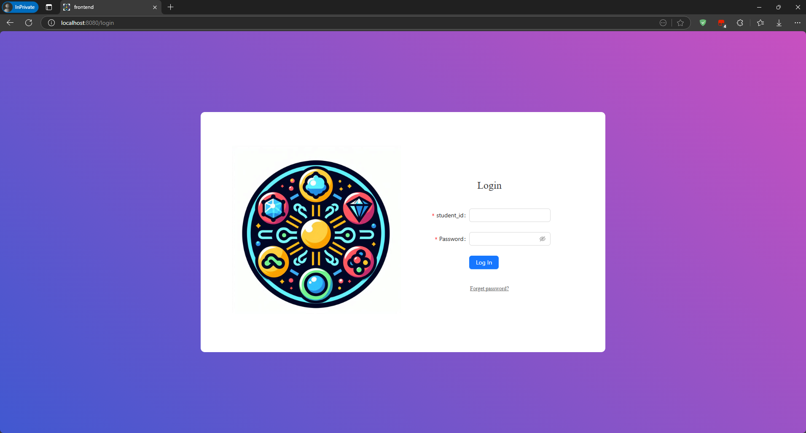
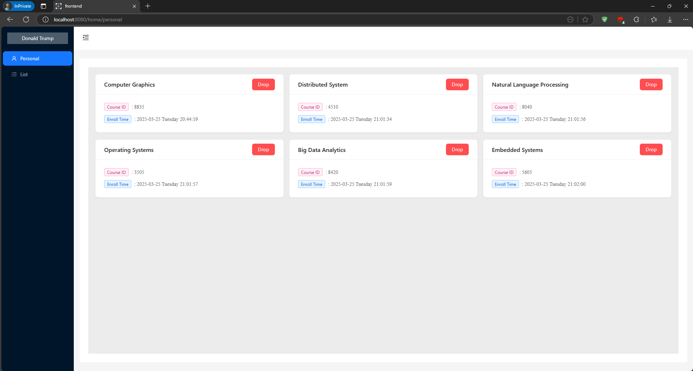
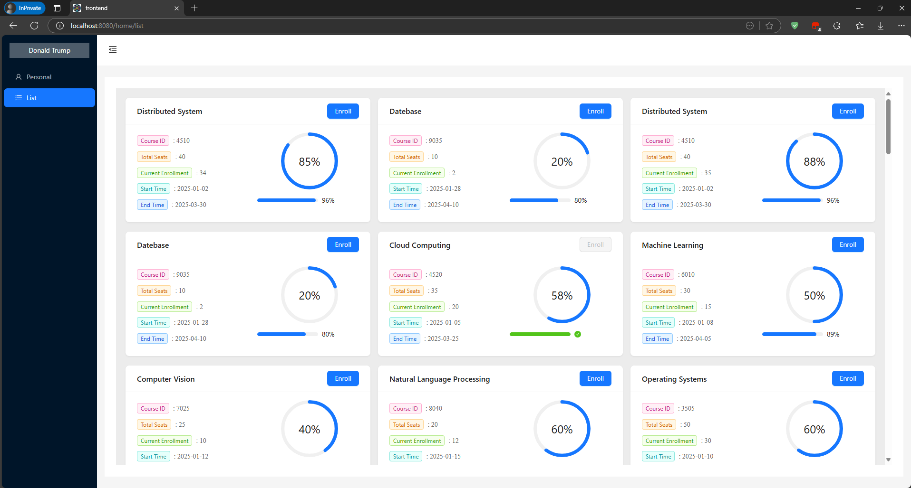
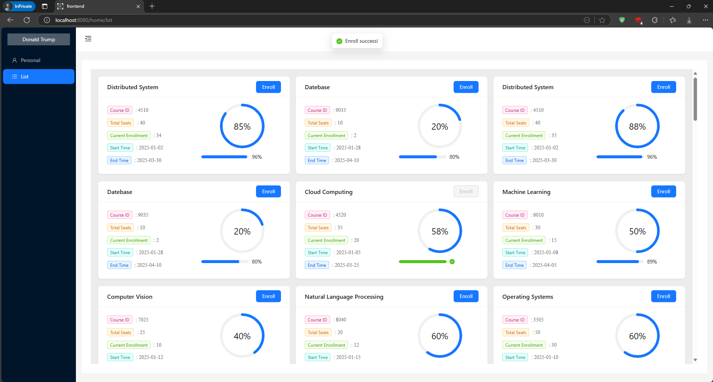

# frontend

## Project setup
```
npm install
```

### Compiles and hot-reloads for development
```
npm run serve
```

### Compiles and minifies for production
```
npm run build
```

## 环境

我是`node v18.20.7`

## 运行










